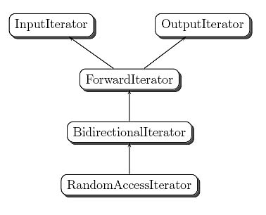
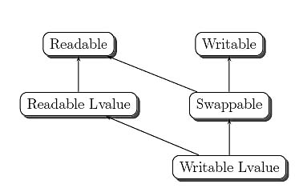
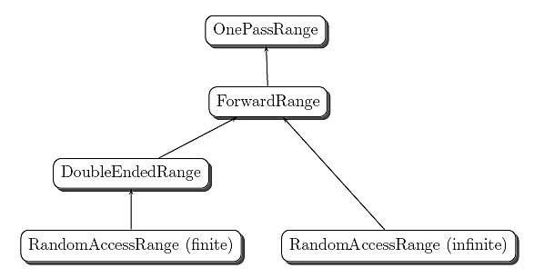

Executive Summary
-----------------

Lisp pioneered forward iteration using singly-linked lists. Later object-oriented container designs often used the Iterator design pattern to offer sequential access using iterators. Though iterators are safe
and sensible, their interface prevents definition of flexible, general, and efficient container-independent algorithms. For example, you can\'t reasonably expect to sort, organize as a binary heap, or even reverse a
container by just using its Iterator. At about the same time, C++\'s Standard Template Library (STL) defines its own conceptual hierarchy of iterators and shows that container-independent algorithms are possible using that hierarchy. However, STL iterators are marred by lack of safety, difficulty of usage, difficulty of definition, and a very close
relationship to C++ that limits adoption by other languages. I propose an API that combines the advantages of Iterator and STL, and I bring evidence that the proposed abstraction is sensible by implementing a
superset of STL\'s algorithms in the D language\'s standard library.

This article is rather long because I\'m attempting not to alienate those unfamiliar with the Standard Template Library, the Iterator design pattern, or functional languages.

Introduction
------------

This article provides a fresh perspective on iteration. I will discuss several typical incarnations of iteration as found in today\'s programming languages, and in particular I\'ll restate the argument
(originally made by Alexander Stepanov [^13]) that if you want to define general algorithms, forward iteration does not suffice. Then I will propose a new approach to iteration that builds on the strengths of
abstractions defined by other languages and libraries. The proposed framework is sensible and expressive, yet one that is simple and obvious in hindsight.

When I set out to define algorithms for D\'s standard library, I initially followed the design of the STL---C++\'s Standard Template Library. That was a relatively easy choice because the STL asked a few
essential questions crisply and answered them saliently as well. After finishing the first iteration of my implementation, the result was rather underwhelming. The STL port to D was almost as verbose and
difficult to use as the C++ original, despite my benefiting from hindsight and a better suited language.

I threw away that first attempt and started a second design that attempted to generalize not starting from pointers (as STL does) and not from streams or singly-linked lists (as other languages do), but instead
from higher-level notions. What came out of that attempt was so fresh, simple, and beautiful that I felt compelled to share it.

Forward Is Not Enough
---------------------

You know what I don\'t like? Emperors clad in boxers. Consider:

```haskel
qsort [] = []
qsort (x:xs) = qsort (filter (< x) xs) ++ [x]
++ qsort (filter (>= x) xs)
```

Code like the above has been used up and down the tubes to demonstrate the superiority of functional languages. It\'s a functional-style quicksort written in Haskell that can be understood, at least according
to some, without any prior exposure. First line: `qsort` of the empty list is the empty list. Second line (broken to fit in a narrow space): `qsort` for a list starting with `x` followed by some more `xs` is a concatenation
(\'++\') of three lists: all stuff in xs that\'s smaller than `x` sorted, `x` itself, and all stuff in xs that\'s greater than or equal to x, again sorted. Try defining quicksort in two lines in your Blub language!

As much as I like Haskell, I look at that example with a mix of admiration and indignation, same as I\'d look at an example illustrating C\'s virtues by means of a buffer overrun exploit. Both cases inspire
awe, but I think they illustrate something bad rather than something good, and I could never bring myself to write or use that kind of trick.

There are a few things about `qsort` that don\'t quite cut the mustard.  For starters, `qsort` is not really quicksort. Quicksort, as defined by Hoare in his seminal paper [^8], is an *in-place* algorithm. Hoare\'s
in-place partition is his paper\'s main contribution and a quintessential part of quicksort. `qsort` is not in-place, so it could be at best considered an exercise inspired by quicksort. (And not a great
exercise at that. It does so much ancillary work it\'s not even funny---did you think that those two passes through the list and all those concatenations come for free?) Second, `qsort` makes a patently bad
choice of pivot by selecting the first element of the sequence, thus nicely guaranteeing quadratic performance for almost sorted data. And the thing is, in reality, input data is seldom really random. It might
have been sorted at some point, then augmented with additional elements, to be sorted again later. Choosing a random pivot is the correct solution, but you see, that would make `qsort` quite a lot longer than
three lines, because selecting one element at random from a singly-linked list is a non-trivial undertaking.

This finally brings me to the third issue I have with qsort, and to the subject of this article: `qsort` sends a subtler message: Singly-linked lists and forward iteration are everything you need. They aren\'t, and
they shouldn\'t be made to seem like they are.

Lisp has pioneered ubiquitous use of singly-linked lists (\"S-lists\").  S-lists connect together data and reference-to-next-element pairs in arbitrary shapes. In fact, S-lists enjoy the *closure* property [^1]
(not to be confused with function closures), meaning that they can represent any data structure, no matter how complex, by encoding it as directed graphs. That seems quite powerful, were it not for the
unfortunate addendum---at a potential polynomial blowup in algorithmic complexity.

Such matters as a polynomial slowdown were too mundane to hinder the power of S-lists, so some functional programmers got imbued with an attitude of contempt toward arrays and associative arrays, data
structures essential to many algorithms. Lisp and other functional languages do offer arrays, but almost invariably as second-class citizens that don\'t enjoy the level of language support that S-lists
do. I\'ve read many texts on functional languages and also written quite a bit of functional code, and I noticed a pattern---a lot of designers go with linear search at the core of the core algorithms without so much
as thinking about it. In fact, \"Structure and Interpretation of Computer Programs\" [^1], a highly revered Scheme-based programming textbook (and one of my personal favorites) uses linear search wherever
anything is to be searched, and only bothers to mention arrays once, specifically to note that arrays do *not* enjoy the closure property, so they are not worthwhile.

I\'m not sure what Alan Perlis had in mind when he quipped, \"Lisp programmers know the value of everything and the cost of nothing,\" but in my humble opinion, functional languages\' over-reliance on
singly-linked lists and relative neglect of arrays and associative arrays are weaknesses, not strengths.

Unfortunately, iteration restricted to forward access, stilted as it is, has propagated into the object era.

The Gang of Four (GoF) Iterator
-------------------------------

The Iterator design pattern prescribes interfaces for accessing container elements. \"Sequential\" is right in the charter of the Iterator pattern as defined in the classic Gang of Four (GoF) book
[Design Patterns: Elements of Reusable Object-Oriented Software](http://www.informit.com/store/product.aspx?isbn=0201633612) [^7]:

Provide a way to access the elements of an aggregate object sequentially without exposing its underlying representation.

When getting into details, the authors amend this simple definition in a number of important ways, such as allowing nonsequential access, but
without any attempt at systematization.

Iterator prescribes the following interface for iteration over a container with elements of type T:

```
interface Iterator {

   void First();     // Restart iteration
   void Next();      // Advance to next item
   bool IsDone();    // Are we done yet?
   T CurrentItem();  // Get current item
}
```

Many of today\'s object-oriented libraries follow this mold. Some drop the First method in favor of a more general method---called ``Clone``, for
example---which returns another Iterator: If you want to save iteration bread crumbs as you move along, you can just create independent copies
of the Iterator object and store them in separate variables. This is more general than just restarting iteration from the first element with ``First``.

In brief, functional languages and object-oriented languages foster distinct iteration styles. The two styles have some differences, but both focus on forward iteration. Focusing on forward iteration may blind
us to the necessity of backward or random access iteration. Going backward through a container using its GoF-style iterator is virtually impossible unless you take the hit of copying the whole thing first. And
this could have been as good as it gets, had the STL not come about.

STL-Style Iteration
-------------------

At the 1968 Olympics, Dick Fosbury took the athletics world by surprise with an unusual high-jump technique. Instead of using any of the known jumping styles, he jumped arching his back and facing the sky.
Fosbury\'s style was so surprising, an ad hoc committee was formed to determine the legitimacy of its use in the competition. The committee authorized Fosbury\'s jumping style, and he went on to win the gold
medal, making history in the process. Today, virtually all high jumpers use Fosbury\'s style.

The STL did something similar with the Iterator pattern. Its approach was so fresh, it could be argued that STL iterators aren\'t really quite the same as the Iterator pattern. STL approached iteration from a
different and much more fertile perspective. The classic Iterator pattern is preoccupied with providing sequential access to containers, leaving algorithms to fend for themselves. The STL focuses on defining
algorithms in their most general, universal form. Iterators tie data structures and algorithms together.

Before the STL, containers offered GoF-style iteration, and some offered index-based access. Alexander Stepanov realized that it all started with algorithms. Algorithms dictate structure over the data they manipulate.
Stepanov further realized that structure must be defined in a way that\'s decoupled from containers. Achieving such decoupling avoids the typical combinatorial explosion of adding algorithm versions for each
new container type.

When *m* algorithms are coupled with *n* containers, there must be *m* \[ts\] *n* algorithm implementations. When *m* algorithms and *n* containers are decoupled, there must only be *m* + *n* algorithm
implementations, which is a much lighter maintenance burden. Decoupling algorithms and containers drove the STL iterator design. It became apparent that different algorithms required different iteration
strategies. Some required forward iteration, others bidirectional iteration, some random access iteration, etc. This led to the STL providing a hierarchy of iterator concepts.

\"Iterator concepts\" is kind of new but rather yawnworthy: sky\'s blue, water\'s wet, and different algorithms work best with different iteration primitives. The remarkable fact is not that there are
different categories of iterators. It\'s that there are only a *few* of them. You see, if 50 algorithms required 30 different categories of iterators, that design would be unwieldy. Conceptual categories are like
function parameters: If there are too many of them, then probably something went wrong. STL has shown that a very generous collection of algorithms can be implemented with only five iterator categories:

-   *Input iterators*, modeling one-pass input such as reading from files or network streams

-   *Output iterators*, modeling one-pass output such as writing to sequential files or network streams

-   *Forward iterators*, modeling access to singly-linked lists

-   *Bidirectional iterators*, modeling access to doubly-linked lists and (somewhat unexpectedly) UTF-encoded strings

-   *Random access iterators*, modeling array access

The conceptual hierarchy of the five iterator categories is quite
simple: input and output are the most primitive, and each of the more
capable categories specializes the previous one, as shown in [Figure 1](https://www.informit.com/content/images/art_alexandrescu3_iterators/elementLinks/alexandrescu3_fig01.jpg).



[Figure 1](javascript:popUp('/content/images/art_alexandrescu3_iterators/elementLinks/alexandrescu3_fig01.jpg'))
The iterator concept hierarchy in STL.

### Building on Pointers

Distinguishing various categories of iterators and placing them in a conceptual hierarchy marks a definite departure of STL from the classic Iterator mold. Another distinguishing characteristic of STL is that it
builds on C++\'s pointers instead of defining a named API.

To access the value referenced by an STL iterator (or C++ pointer), named iter, you dereference it with the notation \*iter. To advance iter to the next value, you increment it with ++iter or iter++. To copy an
iterator, you simply assign iter to another variable. Finally, to determine when the range of values has been exhausted, you compare the iterator to an end-of-the-range iterator kept separately. Unlike the GoF iterator,
a C++ iterator does not know when it has exhausted the range, just as a pointer traversing an array has no knowledge of the extent of the array.

Bidirectional iterators also define \--iter allowing you to move one position to the left, and random access iterators define addition of an integer (e.g., iter = iter + 5), indexed access (e.g., iter[^5]), and
distance between iterators (e.g., int to\_go = end - iter). Thanks to this setup, built-in pointers enjoyed random access iterator status---the most powerful of all---by default, without having to do
anything. If you were a pointer, you were born into RandomAccessIterator royalty.

All of the above primitives take constant time. It would be possible to make iter += n work with a non-random iterator by evaluating ++iter n times, but that would take *O*(*n*) time, which in turn would wreak
havoc with algorithms that rely on iter += n as a constant-time primitive.

STL\'s adoption of pointer-like syntax and semantics, as opposed to the traditional approach using named interface functions, was a brilliant strategic move helping rapid adoption of the library. STL algorithms
worked with pointers straight out of the box, so they could be used with existing arrays without much fuss. Even better, code that used iterators looked like nicely crafted code using pointers, so people could easily
relate to such code and write more of it. It all made so much sense that the usually conservative ANSI/ISO standardization committee serendipitously decided to integrate STL into C++98 without the usual
lengthy committee process---and the rest, as they say, is history. To many people, STL is one of the finest libraries of containers and algorithms around. That the STL achieved such a feat in a language
lacking support for Lambda functions is akin to a boxer, one arm tied behind his back, beating the champion of a heavier weight class.

### Problems with STL Iterators

Time has passed, experience with the STL has grown, and people naturally started seeing issues with it and looking into ways to improve it.  STL\'s quest---that of defining the most general and most widely
applicable definitions of algorithms---has remained as worthy as ever, but it became increasingly clear that there may be more than one path to that goal.

#### Ad Hoc Pairing

STL\'s use of pointers as the basic model for abstraction meant that most of the time you need two iterators, not one, to do anything useful.  A lone iterator is insufficient because you can\'t move it in any
direction without ensuring (or, more dangerously, assuming) that it stays within its bounds. (This is reminiscent of C-style coding, where you\'d need to pass arrays around as a pointer and a length.)

The need to pass most iterators around in pairs begs for an abstraction that puts them together as a cohesive unit. Without such an abstraction, code using iterators has to overcome many difficulties. For example
iterator-based code is not composable. STL expects the two iterators describing a range as two distinct parameters, so you can\'t pass the result of a function straight into an STL function; you need to create
named variables at every step along the way.

#### Traversal and Access

In the STL, \*iter must be a reference to T and may or may not allow updates, depending on whether T is a const type. Sometimes, changing the referenced value is not even an option, as the underlying data source
may be a read-only container or even an input stream.

Abrahams et al. [^3] draw on existing experience with the STL to propose an extension to it that separates traversal and access into orthogonal concepts. Their suggestion is to classify iterators
additionally in a second hierarchy of categories. These new categories are orthogonal to the classic iterator categories in [Figure 1](https://www.informit.com/content/images/art_alexandrescu3_iterators/elementLinks/alexandrescu3_fig01.jpg).

In brief:

-   **Readable iterators:** You can write `value = *iter`.

-   **Writable iterators:** You can write `*iter = value`.

-   **Swappable iterators:** You can write `iter_swap(iter1, iter2)`.

-   **lvalue iterators:** You can write address = `&(*iter);` that is,
    you can take the address at which the iterated element lies in memory

[Figure 2](https://www.informit.com/content/images/art_alexandrescu3_iterators/elementLinks/alexandrescu3_fig02.jpg)
illustrates the relationships among these categories. Any of them can be combined with one classic category in [Figure 1](https://www.informit.com/content/images/art_alexandrescu3_iterators/elementLinks/alexandrescu3_fig01.jpg).
For example, you could define and use a bidirectional swappable
iterator.



[Figure 2](javascript:popUp('/content/images/art_alexandrescu3_iterators/elementLinks/alexandrescu3_fig02.jpg'))
The iterator access hierarchy proposed for the STL by Abrahams et al. [^3] #### Lack of Safety

STL iterators are unsafe in several ways. Correct pairing of iterators bracketing a range is left entirely to the user, and wrong pairings are easy to produce and expensive to check. It\'s also expensive to check
against advancing an iterator beyond a range\'s bounds. In fact, none of iterator\'s primitives naturally support checking. Why? Because iterators are modeled after pointers, and pointers are *also* not
naturally checkable. (Iterators also have invalidation problems---when a container changes, it may pull the rug out from under the iterators currently referring to elements of that container, but that is less of
an iterator interface issue and more of a memory model issue.)

\"Safe\" STL implementations painstakingly address safety issues by implementing an alternative design based on \"fat iterators\"---pairs of iterators---to then emulate ordinary STL iterators. Such implementations
are in fact mute witnesses that the abstractions from pointers come with pointers\' specific problems. It would be desirable to have a design that does not need expensive logic and data to provide even a minimal
level of checking.

#### Quirks

Various quirks of C++ make the task of defining and using iterators unduly difficult. Defining a correct iterator is notoriously hard, to the extent that Boost defined a special library to help with just
that [^2]. This in spite of the fact that an iterator really needs to define only three basic operations (compare, advance, and dereference).  Code using iterators can be pretty complex, too. For example, naysayers
commonly bring up examples like this:

```cpp
vector<int> v = ...;
for (vector<int>::iterator i = v.begin(); i != v.end(); ++i) {
... use *i ...
}
```

which is syntactically noisier than old-style iteration using an index, or even than the name-based GoF-style iteration. (I am not under the illusion that for\_each fixes that problem, and please don\'t send me
angry email about this.)

There are quite a few other iterator-related annoyances of increasing subtlety. Input and forward iterators are syntactically identical but subtly different semantically---copying a forward iterator saves
iteration state, but copying an input iterator just creates a new view of the same iteration state. This makes for more puzzling runtime errors.

In an attempt to improve iterator usage, Adobe [^4] and Boost [^12] independently defined an abstraction called *range* that pairs two iterators together. Of course, the iterators must belong to the same
logical collection (or stream). Then, algorithms can use a range whenever a pair of iterators is expected, which makes pairing errors both less likely and easier to spot. When calling an algorithm with
ranges, you write:

```cpp
vector<int> v;
//...snip
// implicitly take the \"all\" range of v*
sort(v);
```
instead of the customary:

```cpp
sort(v.begin(), v.end());
```

If you use algorithms a lot, such ranges will simplify much of your code. Composition with ranges is significantly easier, too. Although these improvements are not insignificant, Adobe/Boost ranges can\'t
address all of the deficiencies in the STL\'s design.

One subtle problem with STL generalizing C++ pointers---if you allow me a little speculation---is that its detailed design is inextricably tied to C++. That makes STL difficult to understand without actually knowing
C++ to a good bit of depth; the putative newcomer who wants to get the gist of the STL without absorbing C++ will meet a wall of detail---some important, much incidental---that is liable to discourage further study.
To this day, the STL is unfortunately still provincial: although revered among C++ programmers, it is virtually absent from the larger programming community. Even languages that came to the fore after the
STL continue to obsess with perfecting the obsolete \"straddle\" high-jump technique. Why? I think it\'s not impossible that the authors of those languages or APIs thumbed with puzzlement through some STL
examples, with this result: \"This is odd... We can do this already...  This is too verbose... Look at this one, it\'s just bizarre.... Aw, forget it. Let\'s just make Find a method of Array.\"

CDJ\#++
-------

CDJ\#++ (already featured in the code snippet above) is the language used throughout for code examples. It is a stylized pseudo-language drawing on C++, C\#, Java, and D. The intent is to keep the article
language-independent and focus on design, not code syntax and other minute details. Languages typically accomplish similar tasks differently, so CDJ\# ++ does not provide constructors or destructors,
mostly glosses over generic type creation and use, defines interfaces
loosely, and makes pass-by-reference optional.

If you are familiar with any of the aforementioned languages, you should have no trouble understanding what CDJ\# ++\'s constructs do, although translating some into a specific language may be difficult.

A Fresh Approach to Iteration
-----------------------------

Notice that GoF iterators are not subject to many of the safety issues of STL iterators. You don\'t need two GoF iterators to iterate over a collection, so pairing-related errors are avoided by design. Also, it is
quite easy to implement some minimal checking inside the primitives IsDone, Next, and CurrentItem, as shown below for a hypothetical iterator over an array holding objects of type T.

```cpp
class ArrayIterator {

   public:
   
      bool IsDone()
      {
      assert(begin \<= end);
      return begin == end;
      }
      
      void Next()
      {
      assert(!IsDone());
      ++begin;
      }
      
      T CurrentItem()
      {
      assert(!IsDone());
      return \*begin;
      }
      
      private:
      T* begin;
      T* end;
}
```

The GoF interface is naturally more robust without necessarily losing efficiency. The conceptual gain is that the limits are now an indivisible unit presenting a higher-level and safer interface.

For some uses, GoF-style iterators can be just as efficient as iterators, though they sometimes suffer a little in the comparison. For example, the tests for IsDone are just as efficient as with iterators.
However, an ArrayIterator is twice the size of an STL iterator, which can be a significant overhead if the iterator is used to refer to a single container element. (For example, consider a large array and a
bunch of iterators referring to elements in it.) Yet in many cases, STL iterators must be used in pairs anyway, and for such cases there is no overhead at all.

On the other hand, the STL has effectively demonstrated that iteration is about more than just IsDone, Next, and CurrentItem. Let\'s adopt and improve on both the STL\'s and the GoF iterator ideas to get an
efficient, flexible, simple, and highly useful iterator. Instead of building upon pointers as the fundamental abstraction, as does the STL, it\'s better to start with the GoF approach. This allows the iterator
type to be smarter and safer without losing efficiency, at least in most use cases. The iterator categories in the STL are highly useful, so let\'s keep them. As the previous example shows, the new iterator must
know its limits---the beginning and end of its range. Therefore, the name of this new candidate abstraction shall be \"range,\" and its refinements---input, output, forward, double-ended, and random access,
if not others---\"categories.\"

### Separating Access from Traversal

This article is concerned with traversal more than access, but the proposal by Abrahams et al. (discussed in the section \"Traversal and Access\") is compelling. Let\'s take one simple abstraction step that
allows us to benefit from the separation, without needing to discuss access details in great detail: We encapsulate the access category of ranges as a type called Ref\<T\>, where T is the native type of the
range. Ref\<T\> is a type that may simply be a synonym for T, or for reference-to-T, but can also be a proxy to a T allowing some or all of read, write, swap, and address taking. Essentially Ref\<T\> is a
wildcard that could fulfill any of the categories in [Figure 2](https://www.informit.com/content/images/art_alexandrescu3_iterators/elementLinks/alexandrescu3_fig02.jpg).  The range categories we discuss below may be parameterized with Ref in
addition to T.

### One-Pass Ranges

Let\'s start with input from a sequential stream, such as reading one keystroke at a time from the keyboard, reading a network packet, or using C\'s fgetc API. For these, we can easily adapt the
IsDone/CurrentItem/Next troika: IsDone checks for end-of-input and fills a one-element buffer held inside the range object, CurrentItem returns the buffer, and Next sets an internal flag that tells IsDone to read the
next element when called. Let\'s define the one-pass interface and also take the opportunity to change the names of the primitives. (As you\'ll soon see, the new names scale better when we extend the interface.)

interface OnePassRange {

bool empty();

Ref\<T\> front();

void popFront();

}

The use of \"interface\" above is informal. Depending on your language of choice, you could use explicit interfaces but also implicit interfaces and duck typing [^10] (e.g., \"If it has empty, front, and
popFront then it\'s an input range\").

To use OnePassRange, you\'d write a loop along the following lines:

OnePassRange r = \...;

for (; !r.empty(); r.popFront()) {

\... use r.front() \...

}

With input ranges, we can already define some pretty neat algorithms, such as the functional powerhouses map and reduce. To keep things simple, let\'s take a look at the find algorithm:

OnePassRange find(OnePassRange r, T value) {

for (; !r.empty(); r.popFront()) {

if (r.front() == value) break;

}

return r;

}

find has a very simple specification---it advances the passed-in range until it finds the value, or until the range is exhausted. It returns the balance of the range starting with the found value.

Note that one-pass ranges allow output as well as input---it\'s up to whichever Ref\<T\> you use to allow reading, writing, or both. If we denote a writable onepass range with WOnePassRange, we can define the
copy algorithm like this:

WOnePassRange copy(

OnePassRange src, WOnePassRange tgt) {

for (; !src.empty();

src.popFront(), tgt.popFront()) {

assert(!tgt.empty());

tgt.front() = src.front();

}

return tgt;

}

The copy function returns the balance of the target range, which allows you to continue copying in it.

### Forward Ranges

Forward ranges are most similar to what functional languages and GoF iterators implement: strictly forward iteration over an in-memory entity.

interface ForwardRange : OnePassRange {

ForwardRange save();

}

ForwardRange defines all of OnePassRange\'s primitives plus save, which returns a snapshot of the iteration state.

Why is just a regular copy not enough?

void fun(ForwardRange r) {

ForwardRange lookIMadeACopy = r;

\...

}

The save method serves two purposes. First, in a language with reference semantics (such as Java), lookIMadeACopy is not a copy at all---it\'s an alias, another reference to the same underlying Range object. Copying
the actual object requires a method call. Second, in a language with value semantics, like C++, there\'s no distinction between copying to pass an argument to a function and copying to save a snapshot of the
range. Calling save makes that syntactically obvious. (This solves a problem that plagues the STL\'s forward and input iterators, which are syntactically indistinguishable while semantically distinct---a
perennial source of trouble.)

Using the forward range interface, we can define a host of interesting algorithms. To get an idea of what range-based algorithms would look like, consider defining a function findAdjacent that advances through a
range until its first and second elements are equal:

ForwardRange findAdjacent(ForwardRange r){

if (!r.empty()) {

auto s = r.save();

s.popFront();

for (; !s.empty();

r.popFront(), s.popFront()) {

if (r.front() == s.front()) break;

}

}

return r;

}

After auto s = r.save(); the ranges s and r are considered independent.  If you attempt to pass a OnePassRange instead of a ForwardRange, the code would not work because OnePassRanges don\'t have a save method. If
ForwardRange just used copying instead of save, then the code would compile with a OnePassRange, but would produce wrong results at runtime.  (For the curious: It would stop at the first step, because r.front() is
trivially equal to s.front() when r and s are actually tied together.)

### Double-Ended Ranges

The next step of range specialization is to define double-ended ranges, characterized by two extra methods, back and popBack, corresponding to front and popFront for forward iteration:

interface DoubleEndedRange : ForwardRange {

Ref\<T\> back();

void popBack();

}

Let\'s try our hand at the reverse algorithm, which reverses a swappable double-ended range in place.

void reverse(DoubleEndedRange r) {

while (!r.empty()) {

swap(r.front(), r.back());

r.popFront();

if (r.empty()) break;

r.popBack();

}

}

Easy as pie. We can define not only algorithms that use ranges, but also new ranges, which is very useful. For example, defining a range Retro that walks a double-ended range backwards is a simple matter of
cross-wiring front with back and popFront with popBack:

struct Retro\<DoubleEndedRange\> {

private DoubleEndedRange r;

bool empty() { return r.empty(); }

Ref\<T\> front() { return r.back(); }

void popFront() { r.popBack(); }

Ref\<T\> back() { return r.front(); }

void popBack() { r.popFront(); }

}

**NOTE**

The name \"retro\" is not quite fitting, but the more correct \"reverser\" seemed forced.
### Random Access Ranges

The most powerful range of all, the random access range, adds constant-time indexed access in addition to the single-ended range primitives. This category of range notably covers contiguous arrays but
also noncontiguous structures such as STL\'s deque. The random access interface offers all of ForwardRange\'s primitives, plus two random access primitives, at and slice. at fetches an element given the index,
and slice produces a subrange lying between two indices.

interface RandomAccessRange : ForwardRange {

Ref\<T\> at(int i);

RandomAccessRange slice(int i, int j);

}

A startling detail is that RandomAccessRange extends ForwardRange, not DoubleEndedRange. What\'s happening? Infiniteness, that\'s what happens.  Consider a simple range that yields numbers modulo 10: 0, 1, 2, ..., 9,
0, 1, .... Given an index, it\'s easy to compute the corresponding series element, so the range is rightfully a RandomAccessRange. But this range does not have a \"last\" element, so it cannot define
DoubleEndedRange\'s primitives. So a random access range extends different concepts, depending on its finiteness.

Many algorithms require constant-time slicing. Consider quicksort as an example: it cannot select a good pivot (ahem) unless it has constant-time random access, and then it needs constant-time slicing to
divide the input in two at a randomly chosen point.

[Figure 3](https://www.informit.com/content/images/art_alexandrescu3_iterators/elementLinks/alexandrescu3_fig03.jpg)
shows the proposed conceptual hierarchy for ranges.

{width="4.267361111111111in" height="2.48125in"}

[Figure 3](javascript:popUp('/content/images/art_alexandrescu3_iterators/elementLinks/alexandrescu3_fig03.jpg'))
The proposed Range concept hierarchy.

Experience with Ranges
----------------------

One very good question is this: Are ranges as defined above expressive enough to allow implementing, for example, all of STL? How about more than that? Clearly iterators, being a lower-level abstraction, can be
used to do things ranges cannot. However, my experience suggests that the loss of expressiveness is minimal and easily outweighed by the advantages of the high-level abstraction and safety of ranges.

I didn\'t know how to prove that ranges are sufficiently expressive. All I could do was to spin some code. As mentioned in the introduction, I\'ve implemented D\'s standard algorithms [^5] entirely in terms of
ranges. D\'s library includes all of STL\'s functionality, and after gaining courage I added quite a few extra algorithms and ranges to it.  The following summarizes my experience with ranges while doing that
work.

Optional Range Capabilities
---------------------------

The range API defined so far is surprisingly capable, allowing the implementation of many algorithms in a container-independent manner.  However, some useful primitives are conspicuously absent. For example,
most random access ranges and some of the others support a notion of length. The length of a range can be computed easily for even an input range by simply walking it to exhaustion, but certain containers
naturally support constant-time length as a primitive.

Interestingly, length is not restricted to a specific range category.  One might suppose that random access ranges must have a length, whereas others don\'t. However, there are random access ranges that don\'t have
a length. Infinite ranges (such as the range of numbers modulo 10 discussed above in the section \"Random Access Ranges\") are an obvious example, but there are more subtle cases. Consider, for example, a
circular buffer implemented atop an array. You can access the ith element in constant time---it\'s the (i % n)th element of the array.  Claiming that the length of the buffer itself is n may, however,
surprise clients: They\'d expect that taking n steps would take them to the end of the sequence, but that doesn\'t happen. Conversely, there are even input ranges that have a length---for example, a range that yields
100 random numbers.

So length is an optional attribute. If the range can define it, it should, but it\'s never obligated to do so. A range-based algorithm may or may not require that length be defined by its range parameters.

Infiniteness is another property that turned out to be quite useful in practice. An infinite forward range would always return false from empty(). Detecting that is difficult in most languages, so a separate
Boolean property or trait isInfinite could be provided. I don\'t think infiniteness is an essential component of a range API, but it was very easy to define in D with no additional effort, and sometimes comes in
quite handy. There is also a relationship (briefly alluded to in the section \"Random Access Ranges\") between random access ranges, double-ended ranges, and infiniteness: If a random access range is
infinite, it extends a forward range. Otherwise, it extends a double-ended range.

Other, more exotic range capabilities are primitives such as lookahead or putback. An input range may have a lookahead capability up to a specified number of elements and/or the feature of allowing an element
to be returned to the range. C\'s sequential file API offers the ungetc function, which is guaranteed to work for at least one character. The primitives lookahead and putback are useful in a variety of
applications, particularly those concerned with parsing streams.

Higher-Order Ranges
-------------------

In keeping with higher-order functions that take and return other functions, a higher-order range is one that aggregates and manipulates other ranges, while itself still offering a range interface. Building
ranges that decorate other ranges is easy, useful, and fun. In fact, higher-order ranges fulfill the promise that many saw in the early days of the STL. Back then, people thought custom iterators would solve many
problems, and consequently defined quite a few of them. The idea, however, has had limited success. I\'m not sure why, but I hypothesize that the difficulties of defining iterators and the verboseness of using
them were possible factors.

Ranges, by contrast, are very easy to define and use. The result of many algorithms are, in fact, custom ranges. Consider, for example, the classic higher-order function filter, which takes a range r plus a
predicate, and returns a range that only offers the elements of r satisfying the predicate. The work that filter itself does is minimal---it merely constructs and returns a range type, call it Filter,
that does the filtration in its iteration primitives.

-   **Laziness.** Higher-order ranges offer the opportunity of doing
    > computation lazily, in the style preferred by functional
    > languages, instead of eagerly. Consider, for example, the STL
    > algorithm set\_union that takes two sorted ranges and yields one
    > sorted range containing the elements of both ranges, in linear
    > time. set\_union is eager---when it returns, it has finished the
    > job. This approach has two problems. First, you need to create
    > (and possibly allocate memory for) the target range. This is
    > wasteful of both memory and time if all you want to do is peek at
    > each element of set\_union in turn and maybe finish the loop
    > without inspecting all elements. Second, eager set\_union needs to
    > read all of its input before finishing, which simply does not work
    > with infinite ranges.

A classic argument in favor of lazy evaluation is that it leads to better modular composition. This is because lazy evaluation allows for much more involved compositions, with powerful generators that construct a large data space, out of which a selector chooses the
items of interest. This advantage has been beautifully argued by Hughes [^9] and is famously used by Google in its implementation of the MapReduce algorithm [^6]. D\'s standard library uses lazy
evaluation wherever possible, to great effect.

-   **Preserving Range Categories.** Recall Retro, a range that
    > traverses a given range backwards. Clearly the original range,
    > call it r, must offer double-ended iteration. Question: If the
    > original range offered random access, should Retro also offer
    > random access? The answer is a resounding yes. As a rule, a
    > higher-order range must offer the highest capability that it can,
    > subject to what the original range can offer. So Retro should do
    > something like this:

    struct Retro\<DoubleEndedRange\> {

    \... as before \...

    static if (isRandomAccess(DoubleEndedRange)

    && hasLength(DoubleEndedRange)) {

    Ref\<T\> at(unsigned i) {

    return r.at(r.length() - 1 - i);

    }

    DoubleEndedRange slice(int i, int j) {

    return r.slice(r.length() - j,

    r.length() - i);

    }

    }

    static if (hasLength(DoubleEndedRange)) {

    unsigned length() {

    return r.length();

    }

    }

    }

    I used the CDJ\#++ construct static if as an optional declaration:
    If the tested condition is true, then the guarded code is compiled
    in; otherwise, it just vanishes. The predicates hasLength and
    isRandomAccess use introspection to figure out during compilation
    whether the original range offers length and random access,
    respectively. Note how DoubleEndedRange also may or may not define
    length, depending on whether r does.

    This kind of optionally enriched interface depending on the type of
    the input puts a great strain on the language\'s static
    introspection mechanisms. I don\'t know of a way to do that in Java
    or C\#, and in C++ things can be done, albeit with difficulty. In D,
    the static if construct exists and makes it easy to define
    isRandomAccess and hasLength. If your target language is dynamic,
    there should be no problem to use dynamic reflection to allow
    clients to discover the capabilities of a range object.

    If static introspection is available, a host of really cool stuff
    can be done. For example, if Retro is composed with itself (e.g.,
    Retro\<Retro\<SomeRange\>\>), why do all the busywork? The entire
    construct should statically boil down to SomeRange at exactly zero
    computational cost.

-   Chain**.** One particularly interesting higher-order range is Chain,
    > which takes two or more ranges, possibly of different categories,
    > and offers a logically contiguous view of those ranges. Then,
    > Chain can be used whenever one single range is expected; the user
    > of Chain has no idea that iteration segues from one range to
    > another. The capabilities of Chain are naturally the intersection
    > of all capabilities of its inputs. For example, for Chain to
    > define length, all of its contained ranges must also define
    > length. If all contained ranges offer random access *and* length,
    > then Chain offers random access as well. In that case, accessing
    > the *n*th element of a Chain is proportional to the number of
    > ranges that the Chain iterates (which could become a complexity
    > threat if the number of ranges is large). With Chain, quite
    > interesting operations become possible. For example, sort(Chain(a,
    > b, c)) sorts a logical array that has three physical arrays as
    > support. Although iteration over Chain is in a sense lazy because
    > it doesn\'t create a contiguous copy of the three arrays, sort
    > itself is not lazy---after it returns, all elements of the three
    > arrays are arranged in sorted order.

Three-Legged Algorithms {#three-legged-algorithms .list-paragraph}
-----------------------

Several algorithms in STL use three iterators: one for the beginning of input, one for the middle, and one for the end. For example, consider STL\'s nth\_element and rotate, with the following (stylized)
signatures:

```
void nth_element(RIt first, RIt mid, RIt last);
void rotate(FIt first, FIt mid, FIt last);
```

where RIt is a random access iterator and FIt is a forward iterator. mid must fall somewhere between first and last. nth\_element is a useful algorithm that moves the smallest mid - first elements of the range
toward the beginning, and makes mid point to exactly the (mid - first)-smallest element in the range. The trick is that nth\_element does not sort anything---it just finds the *n*th smallest element (hence
its name). Sorting the range and then looking at mid would achieve the same result, but nth\_element does considerably less work than sort, important when handling large data sets. (nth\_element is used in index
searching and nearest-neighbors algorithms.)

rotate is one of my favorites but has a rather arcane name. It rearranges elements in the range (using standard math interval notation) \[first, last) such that the elements in \[mid, last) appear before the
elements in \[first, mid). Put another way, rotate is a bring-to-front operation: The \[mid, last) portion is brought to the front of the range. Naively implemented, rotate could take a long time, but the
algorithm is quite clever about minimizing data moves.  **NOTE**

I happen to think that bring\_to\_front would be a much more intuitive
name than rotate.

How can such functions be translated into range lingo? This was quite a conundrum that had me thinking for quite a while, until I realized a simple fact: Three-legged algorithms conceptually do *not* take three
iterators. They take two *ranges*, left and right! The left-hand range is \[first, mid), and the right-hand one is \[mid, last). Armed with this simple fact, I first defined and implemented nth\_element and
rotate as follows:

```cpp
void nth_element(RR left, RR right);
void rotate(FR left, FR right);
```

where RR is a random access range and FR is a forward range. If you want
to call the functions for a given range, you just say, for example:

```d
Range r = ...;

nth_element(r.slice(0, 5),

r.slice(5, r.length));

rotate(r.slice(0, 5),

r.slice(5, r.length));
```

Similar reasoning can be applied for all three-legged STL algorithms, such as partial\_sort. This solution was satisfactory, and I was ready to leave it at that, when opportunity knocked at the door in the form of
a neat generalization. Consider defining the functions above like this: void nth\_element(R1 left, R2 right);

```d
void rotate(R1 left, R2 right);
```

where R1 and R2 are two *arbitrary* ranges that need not be adjacent and not even of the same category. (Adjacency does not inform the algorithms at all.) Suddenly, we have much more potent algorithms to play with. For
example, nth\_element not only can find the *n* smallest elements in one range; it can do so in two unrelated ranges sitting in memory at different places! Even better, R2 for nth\_element does not need to be
random access---an input range would suffice. The implementation of nth\_element can detect that and use different algorithms depending on R2\'s capability.

Using two ranges instead of three iterators not only solves the problem,
but offers additional functionality.

Weaknesses
----------

My (and many others\') natural inclination when switching from STL iterators to ranges was to think of iterator-based designs in terms of ranges, just as I\'d think of writing programs in a new language by
using idioms popular in languages I already knew. This approach has revealed a few iterator-based designs that can\'t be translated easily to ranges. One example is Boost MultiIndex [^11], which stores
iterators to containers in indexes. Storing one-element ranges instead doubles the size of the index.

Another weakness I noticed is visible when translating STL algorithms that return one iterator, such as find, which has this signature:

```cpp
It find(It b, It e, E value)
```

where It is a one-pass iterator type and E is the type referenced by the iterator. STL\'s find returns the first iterator iter between b and (excluding) e that satisfies \*iter == value. Once that iterator is
returned, you can combine it with b to obtain the range before value, or with e to obtain the range after value.

Ranges lack such capabilities. The range-based find has this signature:

```d  
Range find(Range r, E value)
```

It consumes from r until it finds value and returns what\'s left of r.  This means that you get access to the portion after the found value, but not before.

Fortunately, this problem is easily solved by defining a new range type, Until. Until is a range that takes another range r and a value v, starts at the beginning of r, and ends just before r.front() == v (or at the
natural end of r if v is not to be found). Lazy computation for the win!

There are likely other things that iterators can do that ranges can\'t---it\'s a given. The good news is that there don\'t seem to be many, so range-based designs don\'t lose many of the tricks you can do with iterators.

One weakness of ranges that is linked to the memory model of the underlying language is their propensity to invalidate when you mutate their underlying container. STL iterators obey well-specified but
unchecked invalidation rules. Once a container is changed in a way that invalidates an iterator, using that iterator firmly steps into undefined behavior territory. Ranges inherit that problem. (As discussed in the
section \"A Fresh Approach to Iteration,\" ranges do improve safety when compared with iterators because they never allow invalid pairs of iterators.) Without having researched the matter, I believe that adding
more safety checks to ranges should proceed more easily than with iterators.

Conclusions
-----------

This article describes ranges---an iteration device that combines the safety, ease of definition, and ease of use of GoF iterators on one hand, with the unparalleled expressive power of STL iterators on the
other. Ranges offer simple definition and use, foster lazy computation without contortions, and offer interesting new opportunities.

Acknowledgments
---------------

This article has benefited from some of the most valuable reviews I\'ve ever received. Without faking modesty, I can say that at least some of the reviewers were more able than me to write this article in the first
place, both from a technical and a literary perspective. If you didn\'t enjoy reading the article, at least you can take solace in thinking that its pre-review draft was much, much worse.

Of course, I sincerely hope you did enjoy what you just read, and I worked hard to maximize the chances of that happening. The following people worked just as hard toward the same goal, and I owe them big, big
thanks: Adam Badura, Walter Bright, Ali Çehreli, Emil Dotchevski, Tony Van Eerd, Neil Groves, Craig Henderson, Daniel Hulme, Scott McMurray, Scott Meyers, Bartosz Milewski, Rob Stewart, and Andrew Sutton.

Normally I wouldn\'t want to single out any one reviewer because I\'d feel I should do the same for most others. But this time I do need to mention Rob Stewart. Rob provided helpful feedback on almost every
single paragraph of the initial draft. Then he provided high-level comments pertaining to the entire construction of the article. If that draft were a building, Rob\'s feedback would have covered every one of
its bricks, then architectural concerns, and finally present and future urban integration considerations.

References
----------

[^1]: Harold Abelson and Gerald J. Sussman. *Structure and Interpretation of Computer Programs*. MIT Press, Cambridge, MA, USA,
1996.

[^2]: David Abrahams, Jeremy Siek, and Thomas Witt. [The Boost.Iterator Library](http://boost.org/doc/libs/1_40_0/libs/iterator/doc/). 2003.

[^3]: David Abrahams, Jeremy Siek, and Thomas Witt. [New Iterator Concepts](http://www.boost.org/doc/libs/1_40_0/libs/iterator/doc/new-iter-concepts.html). 2006.

[^4]: Adobe. [Adobe Source Library](http://stlab.adobe.com/).

[^5]: Andrei Alexandrescu. [std.algorithm in the Phobos Library](http://digitalmars.com/d/2.0/phobos/std_algorithm.html). 2009.

[^6]: Jeffrey Dean and Sanjay Ghemawat. \"Mapreduce: Simplified Data Processing on Large Clusters.\" *Commun. ACM*, 51(1):107--113, 2008.

[^7]: Erich Gamma, Richard Helm, Ralph Johnson, and John Vlissides.  [Design Patterns: Elements of Reusable Object-Oriented Software](http://www.informit.com/store/product.aspx?isbn=0201633612). Addison-Wesley, Boston, MA, 1995.

[^8]: Sir Charles Antony Richard Hoare. \"Quicksort.\" *The Computer Journal*, 5(1):10--16, 1962.

[^9]: John Hughes. \"[Why Functional Programming Matters](http://www.cs.chalmers.se/~rjmh/Papers/whyfp.html).\" *Comput.  J.*, 32(2):98--107, 1989.

[^10]: Andrew Koenig. \"[Templates and Duck Typing](http://www.ddj.com/cpp/184401971).\" *Dr. Dobb\'s Journal*, June 2005. .

[^11]: Joaquín M. López Muñoz. [The Boost.MultiIndex Library](http://www.boost.org/doc/libs/1_40_0/libs/multi_index/doc/index.html).  2003.

[^12]: Thorsten Ottosen. [The Boost Range Library](http://boost.org/doc/libs/1_39_0/libs/range/). 2003.

[^13]: Alexander Stepanov and Meng Lee. \"[The Standard Template Library](http://www.stepanovpapers.com/STL/DOC.PDF).\" Technical report, WG21 X3J16/94-0095, 1994.
